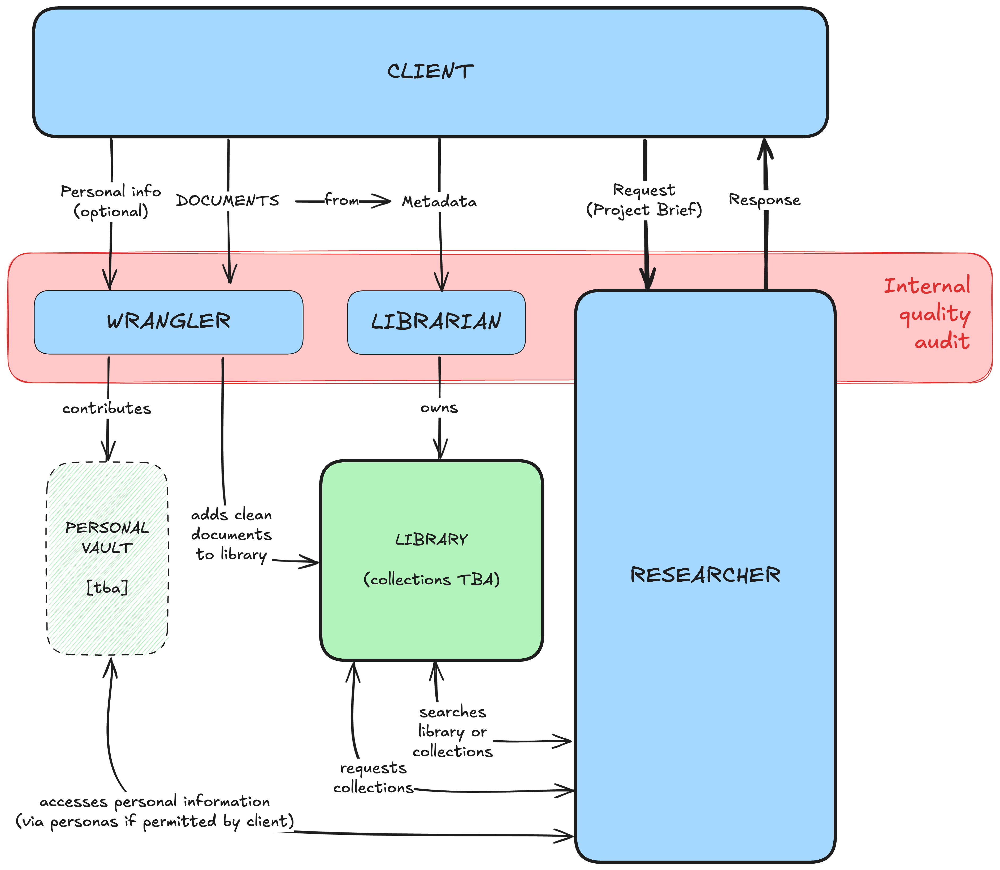

[](https://www.gnu.org/licenses/gpl-3.0)
[](https://www.python.org/downloads/)
[]()


*This project is my attempt to learn fully AI-based 'vibe' coding and to document my use of AI coding assistants [transparently](./docs/development/process/methodology/ai-assistance.md). Expect breaking changes before v1.0.*


# `ragged`

## Privacy-First Local RAG System

**Your private, intelligent document assistant that runs entirely on your computer:** `ragged` is a local RAG *(Retrieval-Augmented Generation)* system that lets you ask questions about your documents and get accurate answers with citations - all while keeping your data completely private and local.

### Principles

1. **Privacy First**: 100% local by default. External services only with explicit user consent.
2. **User-Friendly**: Simple for beginners, powerful for experts (progressive disclosure).
3. **Transparent**: Open source, well-documented, educational.
4. **Quality-Focused**: Built-in evaluation and testing from the start.
5. **Continuous Improvement**: Each version adds value while maintaining stability.

### Aspirations

- 📚 **Multi-Format Support**: Ingest PDF, TXT, Markdown, and HTML documents
- 🧠 **Semantic Understanding**: Uses embeddings to understand meaning, not just keywords
- 🔍 **Smart Retrieval**: Finds relevant information across all your documents
- 💬 **Accurate Answers**: Generates natural language responses with source citations
- 🔒 **100% Private**: Everything runs locally - no data leaves your machine
- ⚡ **Hardware Optimised**: Supports CPU, Apple Silicon (MLX), and CUDA (planned)
- 🎨 **Intuitive CLI**: Command-line interface with progress bars and colours
- 📄 **PDF Intelligence**: Automatic quality detection and correction for messy PDFs (v0.3.5)
- 🗂️ **Metadata Management**: Tag, search, and organise documents (v0.2.8)
- 📝 **Query History**: Save and replay queries (v0.2.8)
- 🔄 **Backup & Restore**: Export and import your data (v0.2.8)

### How It Works

*It's simple:* Upload your documents (PDFs, text files, web pages), ask questions, and `ragged` finds the most relevant information to respond -— all running locally on your machine.



1. **Ingest**: Add documents to the knowledge base ('library')
2. **Process**: Documents are chunked and embedded for semantic search
3. **Store**: Embeddings are stored in a local vector database
4. **Query**: Ask questions in natural language
5. **Retrieve**: `ragged` finds the most relevant document chunks
6. **Generate**: A local LLM generates an answer with citations (planned)


## Quick Start

### Prerequisites

- Python 3.12
- [Ollama](https://ollama.ai) installed and running (optional for v0.2 web UI)
- ChromaDB (via Docker or pip)

### Installation

```bash
# Clone the repository
git clone https://github.com/REPPL/ragged.git
cd ragged

# Create virtual environment
python3 -m venv .venv/ # or python, depending on your system
source .venv/bin/activate  # On Windows: .venv\Scripts\activate

# Install dependencies
pip install -e .

# Start services
docker compose up -d  # Starts ChromaDB (if using Docker)
ollama serve          # Start Ollama (in separate terminal)
```

### Basic Usage

```bash
# Ingest documents (v0.5.3+)
ragged ingest pdf document.pdf                    # Single PDF (auto-corrects)
ragged ingest pdf document.pdf --vision           # With vision embeddings
ragged ingest batch ./docs/ --vision              # Batch ingest with vision
ragged ingest status                              # Check ingestion stats

# View PDF quality and corrections (v0.3.5+)
ragged show quality <document_id>                 # Quality report with issues
ragged show corrections <document_id>             # Applied corrections
ragged show uncertainties <document_id>           # Low-confidence sections

# Multi-modal queries (v0.5.3+)
ragged query text "What are the key findings?"    # Text query
ragged query text "database schema" --boost-diagrams  # Boost visual content
ragged query image architecture.png               # Image similarity search
ragged query hybrid "auth flow" diagram.png       # Text + image query
ragged query interactive                          # Interactive REPL mode

# Advanced search and filtering (v0.2.8+)
ragged search "machine learning" --path "research/*.pdf"
ragged metadata update document.pdf --set category=research

# Query history and replay (v0.2.8+)
ragged history list
ragged history replay 5

# GPU & Storage Management (v0.5.3+)
ragged gpu list                            # List GPU devices
ragged gpu info cuda:0                     # Device specifications
ragged gpu stats --watch                   # Real-time memory monitoring
ragged gpu benchmark                       # Benchmark vision embeddings
ragged storage info                        # Collection statistics
ragged storage migrate                     # Migrate to v0.5 schema
ragged storage vacuum                      # Clean orphaned embeddings

# Manage your knowledge base
ragged list                                # List documents
ragged metadata list                       # Show document metadata (v0.2.8+)
ragged clear                               # Clear all documents

# Configuration and health
ragged config show                         # View configuration
ragged config set-model                    # Interactive model selection (v0.2.8+)
ragged config reset                        # Reset to defaults (v0.5.3+)
ragged health                              # Check service status
ragged validate                            # Validate configuration (v0.2.8+)

# Backup and maintenance (v0.2.8+)
ragged export backup --compress            # Create compressed backup
ragged cache clear --all                   # Clear caches

# Environment information (v0.2.8+)
ragged env-info                            # System information for bug reports
ragged completion --install                # Install shell completion
```

---

## CLI Features

ragged includes a comprehensive CLI with 25+ commands organised into groups:

**Document Ingestion (v0.5.3+):**
- `ingest pdf` - Ingest PDFs with vision embeddings and auto-correction
- `ingest batch` - Batch process directories with pattern matching
- `ingest status` - View ingestion statistics

**Multi-Modal Queries (v0.5.3+):**
- `query text` - Text queries with visual content boosting
- `query image` - Visual similarity search
- `query hybrid` - Combined text + image queries with RRF fusion
- `query interactive` - Interactive REPL mode

**GPU Management (v0.5.3+):**
- `gpu list` - List available devices (CUDA/MPS/CPU)
- `gpu info` - Device specifications and memory
- `gpu stats` - Real-time memory monitoring
- `gpu benchmark` - Performance testing

**Storage Management (v0.5.3+):**
- `storage info` - Collection statistics
- `storage migrate` - Schema migration (v0.4→v0.5)
- `storage vacuum` - Clean orphaned embeddings

**Document Management:**
- `list` / `clear` - View or remove documents
- `metadata` - Tag, update, and search document metadata
- `search` - Advanced search with filters
- `show` - View PDF quality reports, corrections, and uncertainties (v0.3.5+)

**Configuration:**
- `config show` - View settings
- `config set` - Update configuration
- `config reset` - Reset to defaults (v0.5.3+)
- `validate` - Validate configuration and environment
- `env-info` - System information for bug reports

**Maintenance:**
- `health` - Check service connectivity
- `cache` - Manage caches and temporary files
- `export` - Backup and restore data
- `history` - View, replay, and export query history

**Utilities:**
- `completion` - Install shell completion (bash/zsh/fish)

**Documentation:**
- [CLI Command Reference](docs/reference/cli/command-reference.md) - Complete technical specifications
- [CLI Features Guide](docs/guides/cli/cli-features.md) - Comprehensive tutorial with examples

---

## Configuration

`ragged` uses environment variables for configuration. Create a `.env` file:

```bash
# Environment
RAGGED_ENVIRONMENT=development
RAGGED_LOG_LEVEL=INFO

# Embedding Model
RAGGED_EMBEDDING_MODEL=sentence-transformers  # or: ollama
RAGGED_EMBEDDING_MODEL_NAME=all-MiniLM-L6-v2

# LLM
RAGGED_LLM_MODEL=llama3.2

# Chunking
RAGGED_CHUNK_SIZE=500
RAGGED_CHUNK_OVERLAP=100

# Services
RAGGED_CHROMA_URL=http://localhost:8001
RAGGED_OLLAMA_URL=http://localhost:11434
```

---

## Troubleshooting

**ChromaDB Connection Issues:**

```bash
# Check ChromaDB is running
docker ps | grep chromadb

# Restart ChromaDB
docker-compose restart chromadb
```

**Ollama Issues:**

```bash
# Check Ollama is running
ollama list

# Pull required model
ollama pull llama3.2
ollama pull nomic-embed-text
```

---

## Tests

### Running Tests

```bash
# Run all tests
pytest

# Run with coverage
pytest --cov=src --cov-report=html

# Run specific test suite
pytest tests/integration/
pytest tests/unit/
```

### Code Quality

```bash
# Format code
black src/ tests/

# Lint
ruff check src/ tests/

# Type check
mypy src/
```

---

## Acknowledgments

Built with:

- [Ollama](https://ollama.ai) - Local LLM inference
- [ChromaDB](https://www.trychroma.com/) - Vector database
- [sentence-transformers](https://www.sbert.net/) - Embeddings
- [PyMuPDF4LLM](https://github.com/pymupdf/RAG) - PDF processing
- [Click](https://click.palletsprojects.com/) & [Rich](https://rich.readthedocs.io/) - CLI

