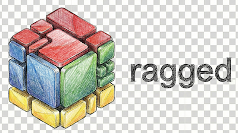

[](https://www.gnu.org/licenses/gpl-3.0)
[](https://www.python.org/downloads/)
[]()


*This project is my attempt to learn fully AI-based 'vibe' coding and to document my use of AI coding assistants [transparently](./docs/development/process/methodology/ai-assistance.md). Expect breaking changes before v1.0.*

---



## Your Private, Intelligent Document Assistant

`ragged` is a local RAG *(Retrieval-Augmented Generation)* system that lets you ask questions about your documents and get accurate answers with citations -- all while keeping your data completely private and local.

### Principles

1. **Privacy First**: 100% local by default. External services only with explicit user consent.
2. **User-Friendly**: Simple for beginners, powerful for experts (progressive disclosure).
3. **Transparent**: Open source, well-documented, educational.
4. **Quality-Focused**: Built-in evaluation and testing from the start.
5. **Continuous Improvement**: Each version adds value while maintaining stability.

### Aspirations

`ragged` aspires to (a) see documents like a human, (b) fix quality issues automatically, and (c) keep your data truly private.

- 📚 **Multi-Format Support**: Ingest PDF, TXT, Markdown, and HTML documents
- 🧠 **Semantic Understanding**: Uses embeddings to understand meaning, not just keywords
- 🔍 **Smart Retrieval**: Finds relevant information across all your documents
- 💬 **Accurate Answers**: Generates natural language responses with source citations
- 🔒 **100% Private**: Everything runs locally - no data leaves your machine
- ⚡ **Hardware Optimised**: Supports CPU, Apple Silicon (MLX), and CUDA (planned)
- 🎨 **Intuitive CLI**: Command-line interface with progress bars and colours
- 📄 **PDF Intelligence**: Automatic quality detection and correction for messy PDFs (v0.3.5)
- 🗂️ **Metadata Management**: Tag, search, and organise documents (v0.2.8)
- 📝 **Query History**: Save and replay queries (v0.2.8)
- 🔄 **Backup & Restore**: Export and import your data (v0.2.8)

### How It Works

*It's simple:* Upload your documents (PDFs, text files, web pages), ask questions, and `ragged` finds the most relevant information to respond -— all running locally on your machine.


1. **Ingest**: Add documents to the knowledge base ('library')
2. **Process**: Documents are chunked and embedded for semantic search
3. **Store**: Embeddings are stored in a local vector database
4. **Query**: Ask questions in natural language
5. **Retrieve**: `ragged` finds the most relevant document chunks
6. **Generate**: A local LLM generates an answer with citations (planned)


## Quick Start

### Prerequisites

- **Docker** and Docker Compose (recommended - easiest setup)
- **[Ollama](https://ollama.ai)** installed and running (for LLM generation)
- Python 3.12 (if running locally without Docker)

### Installation with Docker (Recommended)

```bash
# 1. Clone the repository
git clone https://github.com/REPPL/ragged.git
cd ragged

# 2. Create environment file (copy from example)
cp .env.example .env

# 3. Start Ollama (in a separate terminal)
ollama serve

# 4. Build and start all containers
docker compose up -d

# 5. Verify containers are healthy
docker compose ps

# All services should show "healthy" or "running"
# - ragged-api: FastAPI backend (http://localhost:8000)
# - ragged-ui: Gradio interface (http://localhost:7860)
# - chromadb: Vector database (http://localhost:8001)
```

**Troubleshooting**: If containers fail to start, see the [Troubleshooting Guide](docs/guides/troubleshooting.md).

### Alternative: Local Installation (Without Docker)

For development or if you prefer running ragged locally:

```bash
# 1. Clone the repository
git clone https://github.com/REPPL/ragged.git
cd ragged

# 2. Create virtual environment
python3 -m venv .venv
source .venv/bin/activate  # On Windows: .venv\Scripts\activate

# 3. Install in editable mode
# This installs ragged from pyproject.toml and makes the 'ragged' command available
pip install -e .

# 4. Verify installation
ragged --version

# 5. Start required services
docker compose up chromadb -d  # Start ChromaDB only
ollama serve                   # Start Ollama (in separate terminal)
```

**Note**: ragged uses modern Python packaging (`pyproject.toml`). There is no `requirements.txt` file - dependencies are defined in `pyproject.toml` and installed automatically with `pip install -e .`.

### Basic Usage: Quick Start

The essential commands to get started. For advanced features, see [CLI Features](#cli-features) below.

```bash
# Check system health
ragged health

# Add your first document
ragged ingest pdf document.pdf                    # Single PDF (auto-corrects)
ragged ingest pdf document.pdf --vision           # With vision embeddings
ragged ingest batch ./docs/ --vision              # Batch process directory

# Ask questions about your documents
ragged query text "What are the key findings?"    # Text query
ragged query text "database schema" --boost-diagrams  # Boost visual content

# View and manage your documents
ragged list                                       # List all documents
ragged clear                                      # Remove all documents

# Configuration
ragged config show                                # View current settings
ragged config set-model                           # Change embedding/LLM model

# Get help
ragged --help                                     # Show all commands
ragged ingest --help                              # Help for specific command
```

**📚 More Commands Available:**
- **Multi-modal queries** (image, hybrid, interactive) → See [CLI Features](#cli-features)
- **GPU management** (list, info, stats, benchmark) → [Advanced Guide](docs/guides/cli/advanced.md)
- **Metadata & search** (tagging, filtering) → [Intermediate Guide](docs/guides/cli/intermediate.md)
- **Complete reference** → [Command Reference](docs/reference/cli/command-reference.md)

---

## CLI Features

ragged includes a comprehensive CLI with 25+ commands organised into groups:

**Document Ingestion (v0.5.3+):**
- `ingest pdf` - Ingest PDFs with vision embeddings and auto-correction
- `ingest batch` - Batch process directories with pattern matching
- `ingest status` - View ingestion statistics

**Multi-Modal Queries (v0.5.3+):**
- `query text` - Text queries with visual content boosting
- `query image` - Visual similarity search
- `query hybrid` - Combined text + image queries with RRF fusion
- `query interactive` - Interactive REPL mode

**GPU Management (v0.5.3+):**
- `gpu list` - List available devices (CUDA/MPS/CPU)
- `gpu info` - Device specifications and memory
- `gpu stats` - Real-time memory monitoring
- `gpu benchmark` - Performance testing

**Storage Management (v0.5.3+):**
- `storage info` - Collection statistics
- `storage migrate` - Schema migration (v0.4→v0.5)
- `storage vacuum` - Clean orphaned embeddings

**Document Management:**
- `list` / `clear` - View or remove documents
- `metadata` - Tag, update, and search document metadata
- `search` - Advanced search with filters
- `show` - View PDF quality reports, corrections, and uncertainties (v0.3.5+)

**Configuration:**
- `config show` - View settings
- `config set` - Update configuration
- `config reset` - Reset to defaults (v0.5.3+)
- `validate` - Validate configuration and environment
- `env-info` - System information for bug reports

**Maintenance:**
- `health` - Check service connectivity
- `cache` - Manage caches and temporary files
- `export` - Backup and restore data
- `history` - View, replay, and export query history

**Utilities:**
- `completion` - Install shell completion (bash/zsh/fish)

**Documentation:**
- [CLI Command Reference](docs/reference/cli/command-reference.md) - Complete technical specifications
- [CLI Features Guide](docs/guides/cli/cli-features.md) - Comprehensive tutorial with examples

---

## Configuration

`ragged` uses environment variables for configuration. Create a `.env` file:

```bash
# Environment
RAGGED_ENVIRONMENT=development
RAGGED_LOG_LEVEL=INFO

# Embedding Model
RAGGED_EMBEDDING_MODEL=sentence-transformers  # or: ollama
RAGGED_EMBEDDING_MODEL_NAME=all-MiniLM-L6-v2

# LLM
RAGGED_LLM_MODEL=llama3.2

# Chunking
RAGGED_CHUNK_SIZE=500
RAGGED_CHUNK_OVERLAP=100

# Services
RAGGED_CHROMA_URL=http://localhost:8001
RAGGED_OLLAMA_URL=http://localhost:11434
```

---

## Troubleshooting

### Common Installation Issues

**"ModuleNotFoundError: No module named 'ragged'"**
- **Cause**: Package not installed or Docker containers not built correctly
- **Docker Solution**: Rebuild containers: `docker compose down && docker compose build --no-cache && docker compose up -d`
- **Local Solution**: Install package: `pip install -e .` (with virtual environment activated)

**"ragged: command not found"**
- **Cause**: Package not installed or virtual environment not activated
- **Solution**:
  1. Activate virtual environment: `source .venv/bin/activate`
  2. Install package: `pip install -e .`
  3. Verify: `ragged --version`

**"Container ragged-api is unhealthy"**
- **Cause**: Import errors, missing dependencies, or configuration issues
- **Solution**: Check container logs: `docker compose logs ragged-api`
- **Common fix**: Rebuild containers with `docker compose build --no-cache`

**"Cannot connect to Docker daemon"**
- **Cause**: Docker Desktop not running
- **Solution**: Start Docker Desktop and wait for it to be ready

**"Address already in use" (Port Conflict)**
- **Cause**: Ollama or another service already using port 11434/8000/7860
- **Solution**:
  - Check running processes: `lsof -i :11434` or `lsof -i :8000`
  - Stop conflicting service or change port in `.env` file

### Service-Specific Issues

**ChromaDB Connection Issues:**

```bash
# Check ChromaDB is running
docker compose ps chromadb

# View ChromaDB logs
docker compose logs chromadb

# Restart ChromaDB
docker compose restart chromadb
```

**Ollama Issues:**

```bash
# Check Ollama is running
ollama list

# Pull required models
ollama pull llama3.2
ollama pull nomic-embed-text
```

**Need More Help?**
- Full troubleshooting guide: [docs/guides/troubleshooting.md](docs/guides/troubleshooting.md)
- Check container health: `docker compose ps`
- View all logs: `docker compose logs --tail=50`
- File an issue: [GitHub Issues](https://github.com/REPPL/ragged/issues)

---

## Tests

### Running Tests

```bash
# Run all tests
pytest

# Run with coverage
pytest --cov=src --cov-report=html

# Run specific test suite
pytest tests/integration/
pytest tests/unit/
```

### Code Quality

```bash
# Format code
black src/ tests/

# Lint
ruff check src/ tests/

# Type check
mypy src/
```
