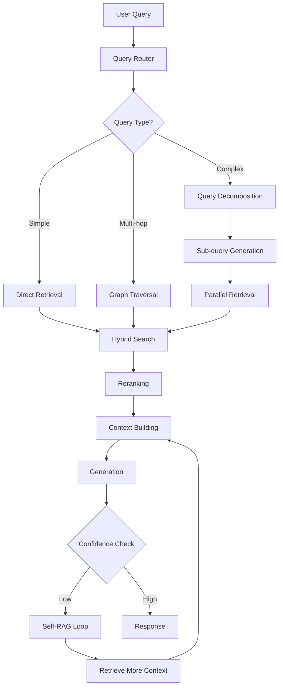

# State-of-the-Art RAG Architecture 2025
## Privacy-First Local RAG System

**Version**: 1.0
**Date**: November 2025
**Project**: ragged - Advanced RAG Architecture Evolution

---

## Executive Summary

This document presents a comprehensive architecture for evolving the ragged project into a state-of-the-art RAG system incorporating the latest 2025 techniques while maintaining its core privacy-first, local-processing principles. The architecture implements a phased approach from MVP (v0.1) to production-ready (v1.0), introducing advanced capabilities including GraphRAG, Self-RAG, Adaptive RAG, and hybrid retrieval strategies.

### Implementation Status (v0.2.2)

This document describes the **complete vision** for ragged v1.0. Current implementation status:

**Core Components:**
- ✅ Basic RAG pipeline (vector search + generation)
- ✅ Hybrid retrieval (BM25 + vector + fusion)
- ✅ Multi-format document loading (PDF, TXT, MD, HTML)
- ✅ Web UI (Gradio) and FastAPI backend
- ✅ Contextual chunking
- 🚧 Document normalisation to Markdown (v0.2 - partial)
- 📋 Semantic chunking (v0.3)
- 📋 Late chunking (v0.3)
- 📋 Cross-encoder reranking (v0.3)

**Advanced Features:**
- 📋 Personal memory system (v0.3)
- 📋 Persona-based interactions (v0.3)
- 📋 Knowledge graph (GraphRAG) (v0.4-v0.5)
- 📋 Self-RAG with confidence scoring (v0.4)
- 📋 Adaptive routing (v0.3-v0.4)
- 📋 Multi-hop reasoning (v0.5)

**Infrastructure:**
- ✅ ChromaDB vector store
- ✅ Ollama LLM integration
- 📋 Graph database (NetworkX → Neo4j/Kuzu) (v0.4-v0.5)
- 📋 Advanced caching (v0.3)
- 📋 Production deployment (v1.0)

See version roadmaps in `docs/development/roadmaps/version/` for detailed timelines.

### Core Design Principles

1. **Privacy-First**: All processing remains 100% local by default
2. **Modular Architecture**: Pluggable components with clear interfaces
3. **Progressive Enhancement**: Each version builds incrementally on the previous
4. **Learning-Focused**: Transparent internals for educational purposes
5. **Production-Ready Path**: Clear evolution from prototype to production

---

## System Architecture Overview

### High-Level Architecture

```
┌─────────────────────────────────────────────────────────────────┐
│                        User Interfaces                           │
│         CLI │ Web UI │ API │ Jupyter Integration                 │
└─────────────────┬───────────────────────────────────────────────┘
                  │
┌─────────────────▼───────────────────────────────────────────────┐
│                    Orchestration Layer                           │
│     Query Router │ Pipeline Manager │ Adaptive Controller        │
└─────────────────┬───────────────────────────────────────────────┘
                  │
┌─────────────────▼───────────────────────────────────────────────┐
│                      Core RAG Pipeline                           │
│  ┌──────────────────────────────────────────────────────────┐  │
│  │ Pre-Processing          │ Retrieval         │ Generation │  │
│  │ • Query Analysis        │ • Vector Search   │ • Context  │  │
│  │ • Query Expansion       │ • Keyword Search  │   Building │  │
│  │ • Intent Classification │ • Graph Traversal │ • Prompt   │  │
│  │ • Query Decomposition   │ • Hybrid Fusion   │   Engineering│ │
│  └──────────────────────────────────────────────────────────┘  │
│                                                                  │
│  ┌──────────────────────────────────────────────────────────┐  │
│  │ Post-Processing         │ Quality Control                 │  │
│  │ • Cross-encoder Rerank  │ • Self-Reflection              │  │
│  │ • Context Compression   │ • Confidence Scoring           │  │
│  │ • Result Fusion         │ • Hallucination Detection      │  │
│  └──────────────────────────────────────────────────────────┘  │
└─────────────────┬───────────────────────────────────────────────┘
                  │
┌─────────────────▼───────────────────────────────────────────────┐
│                    Storage & Indexing Layer                      │
│  ┌────────────┐ ┌────────────┐ ┌────────────┐ ┌────────────┐  │
│  │ Vector DB  │ │ Document   │ │ Graph DB   │ │ Cache      │  │
│  │ ChromaDB → │ │ Storage    │ │ NetworkX → │ │ Redis/     │  │
│  │ Qdrant     │ │ Library    │ │ Neo4j      │ │ SQLite     │  │
│  └────────────┘ └────────────┘ └────────────┘ └────────────┘  │
└─────────────────┬───────────────────────────────────────────────┘
                  │
┌─────────────────▼───────────────────────────────────────────────┐
│                      Model Services Layer                        │
│  ┌────────────┐ ┌────────────┐ ┌────────────┐ ┌────────────┐  │
│  │ LLM        │ │ Embeddings │ │ Reranker   │ │ Classifier │  │
│  │ Ollama     │ │ Sentence   │ │ Cross-     │ │ Intent     │  │
│  │ MLX        │ │ Transformers│ │ Encoder    │ │ Detection  │  │
│  └────────────┘ └────────────┘ └────────────┘ └────────────┘  │
└──────────────────────────────────────────────────────────────────┘
```

### Component Interaction Flow



---

## Document Processing & Normalisation

**Critical Design Decision**: ragged normalises ALL input formats to standardised Markdown before chunking and embedding. This significantly enhances retrieval quality, consistency, and user experience.

### Why Markdown Normalisation?

1. **Consistent Chunking**: Same chunking algorithms work across all document types
2. **Structure Preservation**: Headings, lists, tables, code blocks maintained
3. **Better Retrieval**: Semantic chunking can leverage heading boundaries
4. **Enhanced Citations**: Display formatted source text, not raw HTML/PDF
5. **Future-Proofing**: Uniform format for GraphRAG entity extraction, multi-modal processing

### Document Processing Pipeline

```
Input File (PDF, HTML, DOCX, Image, etc.)
    │
    ▼
Format Detection (MIME type + magic bytes)
    │
    ▼
┌───────────────────────────────────────────┐
│     Format-Specific Processors            │
│                                            │
│  PDF → Docling (IBM, SOTA tables)        │
│  HTML → Trafilatura (news/web articles)  │
│  Scanned → PaddleOCR (layout-aware)      │
│  DOCX/PPTX → Docling (multi-format)      │
│  TXT/MD → Direct ingestion               │
└───────────────────┬───────────────────────┘
                    │
                    ▼
          Metadata Extraction
          (GROBID for academic papers,
           Trafilatura for web articles)
                    │
                    ▼
          Normalise to Markdown
          (Clean, validate structure)
                    │
                    ▼
          Duplicate Detection
          (SHA256 → MinHash → Embeddings)
                    │
                    ▼
          Store Markdown + Metadata
          (normalised/ + metadata/ directories)
                    │
                    ▼
          Chunking (version-specific strategy)
                    │
                    ▼
          Embedding & Vector Storage
```

### Format-Specific Processors

#### 1. PDF Documents (Academic Papers, Reports, Books)

**Processor**: **IBM Docling** (primary)

**Capabilities**:
- Best-in-class table extraction (97.9% accuracy)
- Structure preservation (headings, sections, lists)
- OCR support for scanned PDFs (30x faster than traditional)
- Multi-format support (PDF, DOCX, PPTX, XLSX)
- Self-hosted (privacy-preserving, no API costs)

**Alternative**: Marker (25 pages/sec on GPU, excellent for batch processing)

**Metadata Extraction**: GROBID (68 bibliographic labels: title, authors, affiliations, DOI, abstract, references, etc.)

#### 2. Web Content (Medium, NYT, WaPo, WSJ, FT)

**Processor**: **Trafilatura**

**Capabilities**:
- Best benchmarks for web content extraction (2025)
- Superior metadata extraction (author, date, title, tags, categories)
- Excellent boilerplate removal (ads, navigation)
- Production-proven (186K articles from 1.5K newspapers)

**Output**: Clean markdown with metadata (Schema.org/Dublin Core compatible)

#### 3. Scanned Documents (Magazines, Old Documents)

**Processor**: **PaddleOCR + PP-Structure**

**Capabilities**:
- Best open-source OCR accuracy
- Layout analysis (multi-column, tables, images, captions)
- Reading order preservation (critical for magazines)
- 80+ languages, GPU-accelerated

**Alternative**: Surya OCR (90+ languages, excellent multi-column support)

**Output**: Reconstructed markdown preserving original layout and reading order

#### 4. Microsoft Office (DOCX, PPTX, XLSX)

**Processor**: **Docling** (same as PDF)

**Capabilities**: Native Office format support, table extraction, slide content extraction

### Duplicate Detection Strategy

**Multi-Level Approach** (filename-independent):

1. **Level 1: Exact Duplicates (SHA256)**
   - Content hash of original file
   - 100% accuracy for identical files
   - Fast (~100MB/s)
   - Detects same paper uploaded as "deep-learning.pdf" and "2301.12345v1.pdf"

2. **Level 2: Near-Duplicates (MinHash + LSH)**
   - Applied to normalised markdown
   - Detects ~80-95% similarity (minor edits, formatting changes)
   - Web-scale performance (sub-second queries for 10K+ documents)
   - Detects arXiv preprint vs. published version

3. **Level 3: Semantic Duplicates (Embedding Similarity)**
   - Document-level embeddings
   - Detects paraphrases, rewrites (>95% similarity)
   - Targeted use for high-value deduplication (v0.3+)

**Storage Strategy**: Single document with multiple file paths tracked, or linked documents for semantic duplicates.

### Metadata Schema

**Base Metadata** (all documents):
- document_id, filename(s), file_type, upload_date, content_hash
- duplicate_of, similarity_score, language, collection, tags
- markdown_path, image_paths, processing_metadata

**Academic Papers** (GROBID-extracted):
- title, authors (with affiliations, ORCIDs), abstract, keywords
- journal/conference, volume, issue, pages, publication_date
- DOI, PMID, arXiv ID, references, figures/tables count

**Web Articles** (Trafilatura-extracted):
- title, author(s), site_name, url, publication_date
- categories, tags, featured_image, word_count

**OCR Metadata** (when OCR performed):
- OCR engine, confidence scores (mean/median/min/max)
- Layout analysis (regions, bounding boxes, multi-column detection)
- Quality flags (low-confidence regions, manual review needed)

**Storage**:
- SQLite database for queryable metadata
- JSON sidecar files per document
- ChromaDB metadata per chunk (inherited from parent document)

### Version Implementation Timeline

| Version | Document Processing Features |
|---------|------------------------------|
| **v0.1** | Basic ingestion: PyMuPDF4LLM (PDF), Trafilatura (HTML), direct TXT/MD. No OCR, minimal metadata. |
| **v0.2** | ⭐ **Full normalisation pipeline**: Docling, PaddleOCR, GROBID, Trafilatura. SHA256 + MinHash duplicate detection. Complete metadata extraction. |
| **v0.3** | Enhanced metadata (references, funding), semantic duplicate detection (embeddings), batch deduplication, collection management. |
| **v1.0** | Metadata UI (visual editor, bulk editing), export (BibTeX, RIS), citation management, processing monitoring, plugin architecture for custom processors. |

**Critical Note**: v0.2 document normalisation is a **key differentiator** for ragged. Most RAG systems process PDFs/HTML directly, losing structure. ragged's markdown-first approach enables superior chunking, retrieval, and user experience.

---

## Implementation Phases

### Version 0.1: MVP/Foundation - Basic RAG with Recursive Chunking

**Timeline**: 2-3 weeks
**Complexity**: Low-Medium

#### Core Features
- Basic RAG pipeline with recursive text splitting
- Single embedding model (Sentence Transformers)
- ChromaDB vector storage with persistence
- Ollama integration for local LLM inference
- Simple CLI interface for document ingestion and querying
- Basic evaluation metrics (response time, relevance score)

#### Technical Components
```python
# Core interfaces
class Document:
    content: str
    metadata: Dict[str, Any]
    chunks: List[Chunk]

class Chunk:
    text: str
    embedding: Optional[np.ndarray]
    metadata: ChunkMetadata

class RAGPipeline:
    def ingest(self, documents: List[Document]) -> None
    def query(self, query: str, k: int = 5) -> Response

# Chunking strategy
class RecursiveTextSplitter:
    separators = ["\n\n", "\n", ". ", " ", ""]
    chunk_size = 500
    chunk_overlap = 100
```

#### Dependencies
- `ollama-python`: LLM interface
- `chromadb`: Vector storage
- `sentence-transformers`: Embeddings
- `langchain`: Document loaders and text splitters
- `click`: CLI framework
- `pydantic`: Data validation

#### Success Criteria
- Successfully ingest and query documents
- Response latency < 5 seconds for simple queries
- Retrieve relevant chunks with > 70% accuracy
- Support PDF, TXT, MD, HTML formats

---

### Version 0.2: Document Normalisation + Enhanced Retrieval

**Timeline**: 6-7 weeks (+2 weeks for document normalisation)
**Complexity**: Medium-High

#### Core Features

**Document Normalisation Pipeline** (NEW - Key Feature):
- **All-format-to-Markdown conversion**: PDF, HTML, DOCX, scanned images → standardized MD
- **Format-specific processors**:
  - PDF/DOCX: IBM Docling (97.9% table accuracy, structure preservation)
  - HTML: Trafilatura (best web extraction, metadata)
  - Scanned docs: PaddleOCR + PP-Structure (layout-aware OCR)
- **Metadata extraction**:
  - Academic papers: GROBID (68 fields: title, authors, DOI, abstract, references)
  - Web articles: Trafilatura (author, date, URL, tags)
- **Duplicate detection**: SHA256 (exact) + MinHash+LSH (near-duplicates)
- **SQLite metadata database** with JSON sidecar files

**Enhanced Retrieval**:
- Hybrid retrieval (BM25 + vector search)
- Cross-encoder reranking for improved relevance
- Query expansion and reformulation
- Metadata filtering and faceted search
- Context window optimisation
- Basic caching layer

**Web UI** (Basic Gradio):
- Simple chat interface with streaming (SSE)
- Document upload interface
- Basic citations (inline with page numbers)
- Source document display

#### Technical Components
```python
# Hybrid retrieval system
class HybridRetriever:
    def __init__(self):
        self.vector_retriever = VectorRetriever()
        self.keyword_retriever = BM25Retriever()
        self.reranker = CrossEncoderReranker()

    def retrieve(self, query: str, k: int = 10) -> List[Document]:
        # Parallel retrieval
        vector_results = self.vector_retriever.search(query, k=k*2)
        keyword_results = self.keyword_retriever.search(query, k=k*2)

        # Fusion strategies
        fused = self.reciprocal_rank_fusion(
            vector_results,
            keyword_results,
            alpha=0.7  # Weight towards vector search
        )

        # Rerank top results
        return self.reranker.rerank(query, fused[:k*2])[:k]

# Cross-encoder reranking
class CrossEncoderReranker:
    model_name = "cross-encoder/ms-marco-MiniLM-L-6-v2"

    def rerank(self, query: str, documents: List[Document]) -> List[Document]:
        scores = self.model.predict(
            [(query, doc.content) for doc in documents]
        )
        return sorted(zip(documents, scores), key=lambda x: x[1], reverse=True)
```

#### New Dependencies

**Document Processing**:
- `docling`: IBM document converter (PDF/DOCX/PPTX → Markdown)
- `trafilatura[all]`: Web content extraction
- `paddleocr`: OCR for scanned documents (optional, GPU recommended)
- `grobid-client-python`: Academic paper metadata extraction
- `python-magic`: File type detection
- `datasketch`: MinHash for duplicate detection

**Enhanced Retrieval**:
- `rank-bm25`: Keyword search
- `faiss-cpu`: Efficient vector search (optional upgrade from ChromaDB)
- `transformers`: Cross-encoder models
- `redis` or `diskcache`: Caching layer

**Web UI**:
- `gradio`: Web interface framework
- `sse-starlette`: Server-sent events for streaming

**Storage**:
- `sqlite3` (built-in): Metadata database

#### Success Criteria

**Document Processing**:
- Successfully convert PDF, HTML, DOCX, scanned images to Markdown
- Preserve document structure (headings, tables, lists) in > 95% of cases
- Extract academic metadata with > 90% completeness (title, authors, DOI)
- Detect exact duplicates (SHA256) with 100% accuracy
- Detect near-duplicates (MinHash) with > 90% recall at 0.8 threshold
- Processing speed: 2-5 pages/second (CPU), 10-20 pages/second (GPU with OCR)

**Enhanced Retrieval**:
- 20-30% improvement in retrieval accuracy vs. v0.1
- Support for complex queries with boolean operators
- Reranking improves top-5 precision by > 15%
- Cache hit rate > 40% for common queries

**Web UI**:
- Functional chat interface with streaming responses
- Document upload and processing works for all supported formats
- Citations displayed with correct page numbers and source links

---

### Version 0.3: Advanced Chunking - Semantic & Late Chunking

**Timeline**: 3-4 weeks
**Complexity**: Medium-High

#### Core Features
- Semantic chunking with embedding-based boundaries
- Late chunking for contextual embeddings
- Document structure preservation
- Multi-level chunking hierarchy
- Contextual retrieval (Anthropic's approach)
- Smart table and code block handling

#### Technical Components
```python
# Semantic chunking
class SemanticChunker:
    def __init__(self, embedder, similarity_threshold=0.8):
        self.embedder = embedder
        self.threshold = similarity_threshold

    def chunk(self, document: Document) -> List[Chunk]:
        sentences = self.split_sentences(document.content)
        embeddings = self.embedder.encode(sentences)

        chunks = []
        current_chunk = []

        for i, (sent, emb) in enumerate(zip(sentences, embeddings)):
            if current_chunk and self.should_split(
                embeddings[i-1], emb
            ):
                chunks.append(self.create_chunk(current_chunk))
                current_chunk = [sent]
            else:
                current_chunk.append(sent)

        return chunks

# Late chunking implementation
class LateChunker:
    """
    Embeds entire document first, then chunks while preserving
    contextual information in embeddings
    """
    def __init__(self, model, max_length=8192):
        self.model = model  # Long-context embedding model
        self.max_length = max_length

    def process(self, document: Document) -> List[ContextualChunk]:
        # Get full document embedding with positional encoding
        full_embedding = self.model.encode_with_positions(
            document.content[:self.max_length]
        )

        # Chunk with boundaries
        chunks = self.identify_boundaries(document)

        # Extract contextual embeddings for each chunk
        contextual_chunks = []
        for chunk in chunks:
            chunk_embedding = self.extract_chunk_embedding(
                full_embedding,
                chunk.start_pos,
                chunk.end_pos
            )
            contextual_chunks.append(
                ContextualChunk(
                    text=chunk.text,
                    embedding=chunk_embedding,
                    context_embedding=full_embedding
                )
            )

        return contextual_chunks

# Contextual retrieval (Anthropic approach)
class ContextualRetriever:
    def enhance_chunk(self, chunk: Chunk, document: Document) -> Chunk:
        # Add context to each chunk
        context = self.generate_context(chunk, document)
        enhanced_text = f"{context}\n\n{chunk.text}"

        # Re-embed with context
        chunk.contextual_embedding = self.embedder.encode(enhanced_text)
        chunk.metadata['context'] = context

        return chunk
```

#### New Dependencies
- `spacy`: Sentence segmentation and NLP
- `nltk`: Additional NLP tools
- `transformers`: Long-context embedding models

#### Success Criteria
- Semantic chunking improves retrieval relevance by > 15%
- Maintain document structure integrity
- Support for documents > 100k tokens
- Reduced hallucination rate through better context

---

### Version 0.4: Adaptive Systems - Self-RAG & Dynamic Retrieval

**Timeline**: 4-5 weeks
**Complexity**: High

#### Core Features
- Self-RAG with reflection and confidence scoring
- Adaptive retrieval strategies based on query type
- Query intent classification and routing
- Iterative retrieval with feedback loops
- Corrective RAG for error recovery
- Dynamic chunk size selection

#### Technical Components
```python
# Self-RAG implementation
class SelfRAG:
    def __init__(self, retriever, generator, critic):
        self.retriever = retriever
        self.generator = generator
        self.critic = critic  # Separate model or same LLM with different prompt

    def process(self, query: str, max_iterations: int = 3) -> Response:
        iteration = 0
        context = []

        while iteration < max_iterations:
            # Determine if retrieval is needed
            needs_retrieval = self.critic.assess_retrieval_need(
                query, context
            )

            if needs_retrieval:
                # Retrieve and assess relevance
                new_docs = self.retriever.retrieve(query)
                relevant_docs = self.critic.filter_relevant(
                    query, new_docs
                )
                context.extend(relevant_docs)

            # Generate response
            response = self.generator.generate(query, context)

            # Self-assessment
            confidence = self.critic.assess_response(
                query, response, context
            )

            if confidence > 0.8:
                return Response(
                    text=response,
                    confidence=confidence,
                    iterations=iteration + 1,
                    context=context
                )

            # Refine query for next iteration
            query = self.critic.refine_query(query, response)
            iteration += 1

        return Response(text=response, confidence=confidence, ...)

# Adaptive RAG controller
class AdaptiveRAG:
    def __init__(self):
        self.query_classifier = QueryClassifier()
        self.strategies = {
            'factual': FactualStrategy(),      # High-precision retrieval
            'analytical': AnalyticalStrategy(), # Multi-document reasoning
            'creative': CreativeStrategy(),     # Minimal retrieval
            'multi_hop': MultiHopStrategy(),    # Graph traversal
            'aggregation': AggregationStrategy() # Map-reduce pattern
        }

    def route(self, query: str) -> Response:
        # Classify query intent and complexity
        query_type = self.query_classifier.classify(query)
        complexity = self.assess_complexity(query)

        # Select strategy
        strategy = self.strategies[query_type]

        # Adapt retrieval parameters
        config = self.adapt_config(query_type, complexity)

        return strategy.execute(query, config)

# Query routing and decomposition
class QueryRouter:
    def process(self, query: str) -> Union[Response, List[Response]]:
        # Decompose complex queries
        if self.is_complex(query):
            sub_queries = self.decompose(query)
            sub_responses = [
                self.process(sq) for sq in sub_queries
            ]
            return self.synthesize(sub_responses)

        # Route to appropriate pipeline
        return self.route_simple(query)
```

#### New Dependencies
- `scikit-learn`: Query classification
- `networkx`: Query dependency graphs
- `asyncio`: Parallel processing

#### Success Criteria
- Self-reflection improves answer quality by > 25%
- Adaptive routing reduces latency by 30% for simple queries
- Support for multi-hop reasoning (2-3 hops)
- Confidence scoring accuracy > 85%

---

### Version 0.5: Knowledge Graphs - GraphRAG Integration

**Timeline**: 5-6 weeks
**Complexity**: High

#### Core Features
- Entity extraction and relationship mapping
- Knowledge graph construction from documents
- Graph-enhanced retrieval patterns
- Community detection and summarization
- Hybrid vector + graph search
- Graph-based reasoning chains

#### Technical Components
```python
# GraphRAG architecture
class GraphRAG:
    def __init__(self):
        self.entity_extractor = EntityExtractor()
        self.relation_extractor = RelationExtractor()
        self.graph_store = Neo4jStore()  # Or NetworkX for local
        self.community_detector = CommunityDetector()

    def build_graph(self, documents: List[Document]):
        for doc in documents:
            # Extract entities and relations
            entities = self.entity_extractor.extract(doc)
            relations = self.relation_extractor.extract(doc, entities)

            # Add to graph
            for entity in entities:
                self.graph_store.add_node(
                    entity,
                    embedding=self.embedder.encode(entity.text)
                )

            for relation in relations:
                self.graph_store.add_edge(
                    relation.source,
                    relation.target,
                    relation_type=relation.type,
                    weight=relation.confidence
                )

        # Detect communities for hierarchical summarization
        communities = self.community_detector.detect(
            self.graph_store.get_graph()
        )

        # Generate community summaries
        for community in communities:
            summary = self.summarize_community(community)
            self.graph_store.add_community_summary(
                community.id,
                summary
            )

    def retrieve(self, query: str) -> GraphContext:
        # Extract query entities
        query_entities = self.entity_extractor.extract_from_query(query)

        # Graph traversal
        subgraph = self.graph_store.get_subgraph(
            query_entities,
            max_hops=2,
            max_nodes=50
        )

        # Combine with vector search
        vector_results = self.vector_store.search(query)

        # Build enriched context
        return GraphContext(
            entities=subgraph.nodes,
            relations=subgraph.edges,
            documents=vector_results,
            community_summaries=self.get_relevant_summaries(query)
        )

# Local graph implementation with NetworkX
class LocalGraphStore:
    def __init__(self):
        self.graph = nx.DiGraph()
        self.node_embeddings = {}

    def add_node(self, entity: Entity, embedding: np.ndarray):
        self.graph.add_node(
            entity.id,
            label=entity.text,
            type=entity.type,
            metadata=entity.metadata
        )
        self.node_embeddings[entity.id] = embedding

    def get_subgraph(self, start_nodes: List[str], max_hops: int = 2):
        # BFS to get k-hop neighborhood
        subgraph_nodes = set()
        current_level = set(start_nodes)

        for _ in range(max_hops):
            next_level = set()
            for node in current_level:
                neighbors = self.graph.neighbors(node)
                next_level.update(neighbors)
            subgraph_nodes.update(current_level)
            current_level = next_level

        return self.graph.subgraph(subgraph_nodes)
```

#### New Dependencies
- `networkx`: Local graph processing
- `neo4j` (optional): Production graph database
- `spacy` or `transformers`: NER for entity extraction
- `community`: Graph community detection

#### Success Criteria
- Entity extraction F1 score > 0.75
- Graph retrieval improves multi-hop QA by > 30%
- Support for graphs with > 1M nodes
- Community summaries reduce retrieval time by 40%

---

### Version 1.0: Production Ready - Full Feature Set

**Timeline**: 4-6 weeks
**Complexity**: High

#### Core Features
- Complete integration of all previous versions
- Production monitoring and observability
- A/B testing framework
- Auto-tuning and optimisation
- Comprehensive evaluation suite
- Plugin architecture for extensions

#### Technical Components
```python
# Production orchestrator
class ProductionRAG:
    def __init__(self, config: RAGConfig):
        self.config = config
        self.components = self.initialize_components()
        self.monitor = ObservabilityMonitor()
        self.evaluator = RAGEvaluator()
        self.optimizer = AutoTuner()

    def initialize_components(self):
        return {
            'chunker': self.create_chunker(),
            'retriever': self.create_retriever(),
            'generator': self.create_generator(),
            'graph': self.create_graph_rag() if self.config.use_graph else None,
            'self_rag': SelfRAG(...) if self.config.use_self_rag else None,
            'cache': CacheManager(...)
        }

    async def process(self, query: str) -> Response:
        # Start monitoring
        trace = self.monitor.start_trace(query)

        try:
            # Adaptive routing
            strategy = self.select_strategy(query)

            # Execute with monitoring
            response = await strategy.execute(
                query,
                components=self.components,
                trace=trace
            )

            # Evaluate quality
            metrics = self.evaluator.evaluate(
                query, response, trace
            )

            # Store for optimisation
            self.optimizer.record(query, response, metrics)

            return response

        finally:
            self.monitor.end_trace(trace)

# Evaluation framework
class RAGEvaluator:
    def __init__(self):
        self.metrics = {
            'faithfulness': FaithfulnessMetric(),
            'relevance': RelevanceMetric(),
            'coherence': CoherenceMetric(),
            'completeness': CompletenessMetric(),
            'latency': LatencyMetric()
        }

    def evaluate(self, query: str, response: Response, trace: Trace):
        results = {}
        for name, metric in self.metrics.items():
            results[name] = metric.compute(query, response, trace)
        return results

# Plugin architecture
class PluginManager:
    def register(self, plugin: RAGPlugin):
        # Validate interface
        self.validate_plugin(plugin)

        # Register hooks
        for hook in plugin.hooks:
            self.hooks[hook].append(plugin)

    def execute_hook(self, hook_name: str, context: Dict):
        for plugin in self.hooks[hook_name]:
            context = plugin.execute(hook_name, context)
        return context
```

#### Production Infrastructure
```yaml
# docker-compose.yml for local deployment
version: '3.8'
services:
  ollama:
    image: ollama/ollama
    volumes:
      - ollama_data:/root/.ollama
    ports:
      - "11434:11434"

  qdrant:
    image: qdrant/qdrant
    volumes:
      - qdrant_data:/qdrant/storage
    ports:
      - "6333:6333"

  redis:
    image: redis:alpine
    volumes:
      - redis_data:/data
    ports:
      - "6379:6379"

  ragged:
    build: .
    depends_on:
      - ollama
      - qdrant
      - redis
    environment:
      - OLLAMA_HOST=http://ollama:11434
      - QDRANT_HOST=http://qdrant:6333
      - REDIS_HOST=redis://redis:6379
    ports:
      - "8000:8000"  # API
      - "8001:8001"  # Monitoring
```

#### New Dependencies
- `prometheus-client`: Metrics collection
- `opentelemetry`: Distributed tracing
- `fastapi`: Production API server
- `pydantic-settings`: Configuration management
- `alembic`: Database migrations
- `pytest-benchmark`: Performance testing

#### Success Criteria
- 99.9% uptime for API endpoints
- P95 latency < 2 seconds for standard queries
- Support for 100+ concurrent users
- Comprehensive test coverage > 90%
- Plugin system with 5+ example plugins
- Full observability with dashboards

---

## Technical Architecture Details

### Data Flow Architecture

```python
@dataclass
class DataFlow:
    """Complete data flow through the system"""

    # Input stage
    raw_document: Document

    # Processing stage
    parsed_content: ParsedDocument
    chunks: List[Chunk]
    embeddings: List[np.ndarray]

    # Storage stage
    vector_ids: List[str]
    graph_nodes: List[Node]
    metadata_records: List[Dict]

    # Retrieval stage
    query: Query
    retrieved_chunks: List[ScoredChunk]
    reranked_chunks: List[ScoredChunk]

    # Generation stage
    context: Context
    prompt: str
    response: Response

    # Evaluation stage
    metrics: EvaluationMetrics
    feedback: UserFeedback
```

### Storage Architecture

```python
class StorageArchitecture:
    """
    Multi-tier storage system for different data types
    """

    def __init__(self):
        # Hot storage - frequently accessed
        self.vector_store = QdrantClient(
            path="./qdrant_data",
            prefer_grpc=True
        )

        # Warm storage - documents and metadata
        self.document_store = SQLiteStore(
            path="./library.db"
        )

        # Graph storage - relationships
        self.graph_store = NetworkXStore(
            path="./graph.pkl"
        )

        # Cache layer - query results
        self.cache = RedisCache(
            host="localhost",
            ttl=3600
        )

        # Cold storage - archived data
        self.archive = S3Compatible(
            path="./archive"
        )
```

### Model Management

```python
class ModelManager:
    """
    Centralized model lifecycle management
    """

    def __init__(self, config: ModelConfig):
        self.models = {}
        self.memory_tracker = MemoryTracker()
        self.performance_monitor = PerformanceMonitor()

    def load_model(self, model_type: str, model_name: str):
        # Check memory availability
        required_memory = self.estimate_memory(model_name)
        if not self.memory_tracker.can_allocate(required_memory):
            self.unload_least_used_model()

        # Load with appropriate backend
        if model_type == "llm":
            model = self.load_ollama_model(model_name)
        elif model_type == "embedding":
            model = self.load_sentence_transformer(model_name)
        elif model_type == "reranker":
            model = self.load_cross_encoder(model_name)

        self.models[model_name] = model
        return model

    def optimize_for_hardware(self):
        """Detect and optimise for available hardware"""
        if self.has_cuda():
            return "cuda"
        elif self.has_mps():  # Apple Silicon
            return "mps"
        else:
            return "cpu"
```

---

## Configuration Management

### Hierarchical Configuration

```yaml
# config/base.yaml
rag:
  version: "1.0"

  chunking:
    strategy: "recursive"  # recursive, semantic, late
    size: 500
    overlap: 100

  embedding:
    model: "all-MiniLM-L6-v2"
    dimension: 384
    batch_size: 32

  retrieval:
    strategy: "hybrid"  # vector, keyword, hybrid, graph
    vector_weight: 0.7
    keyword_weight: 0.3
    top_k: 10
    rerank: true

  generation:
    model: "llama2:7b"
    temperature: 0.7
    max_tokens: 2000

  evaluation:
    metrics:
      - faithfulness
      - relevance
      - coherence
    threshold: 0.7

# config/profiles/research.yaml
rag:
  chunking:
    strategy: "semantic"
    size: 800  # Longer chunks for academic papers

  retrieval:
    top_k: 15  # More context for research

  generation:
    temperature: 0.3  # More factual

# config/profiles/creative.yaml
rag:
  retrieval:
    top_k: 5  # Less constraint

  generation:
    temperature: 0.9  # More creative
```

### Environment-Specific Configuration

```python
class ConfigManager:
    def __init__(self):
        self.base_config = self.load_base()
        self.profile = self.detect_profile()
        self.overrides = self.load_overrides()

    def get_config(self) -> RAGConfig:
        # Merge in order of precedence
        config = deep_merge(
            self.base_config,
            self.profile_config,
            self.env_config,
            self.runtime_overrides
        )

        # Validate
        self.validate_config(config)

        return RAGConfig(**config)

    def auto_tune(self, metrics: EvaluationMetrics):
        """Automatically adjust configuration based on performance"""
        if metrics.latency > 5.0:
            self.config.retrieval.top_k = max(5, self.config.retrieval.top_k - 2)

        if metrics.relevance < 0.6:
            self.config.retrieval.strategy = "hybrid"
            self.config.chunking.size = max(300, self.config.chunking.size - 100)
```

---

## Performance Optimisation

### Memory Optimisation Strategies

```python
class MemoryOptimizer:
    def __init__(self, total_memory_gb: int = 128):
        self.total_memory = total_memory_gb * 1024 * 1024 * 1024
        self.allocations = {}

    def optimize_allocation(self):
        """
        Optimal allocation for 128GB system:
        - OS/System: 8GB
        - LLM: 40GB (Llama 70B quantized)
        - Embeddings: 2GB
        - Vector DB: 20GB (in-memory index)
        - Document cache: 10GB
        - Graph DB: 5GB
        - Working memory: 43GB (context, intermediate results)
        """
        return {
            'llm': 40 * 1024**3,
            'embeddings': 2 * 1024**3,
            'vector_db': 20 * 1024**3,
            'document_cache': 10 * 1024**3,
            'graph_db': 5 * 1024**3,
            'working': 43 * 1024**3
        }
```

### Query Optimisation

```python
class QueryOptimizer:
    def optimise(self, query: str) -> OptimizedQuery:
        # Query analysis
        complexity = self.analyze_complexity(query)
        intent = self.classify_intent(query)

        # Optimisation strategies
        if complexity < 0.3:
            # Simple query - use cache aggressively
            return OptimizedQuery(
                strategy="cache_first",
                retrieval_k=5,
                use_reranking=False
            )
        elif complexity < 0.7:
            # Medium complexity - standard pipeline
            return OptimizedQuery(
                strategy="hybrid",
                retrieval_k=10,
                use_reranking=True
            )
        else:
            # Complex query - full pipeline
            return OptimizedQuery(
                strategy="adaptive",
                retrieval_k=20,
                use_reranking=True,
                use_self_rag=True
            )
```

---

## Evaluation Framework

### Comprehensive Evaluation Metrics

```python
class EvaluationSuite:
    def __init__(self):
        self.metrics = {
            # Retrieval metrics
            'precision_at_k': PrecisionAtK(),
            'recall_at_k': RecallAtK(),
            'mrr': MeanReciprocalRank(),
            'ndcg': NDCG(),

            # Generation metrics
            'faithfulness': Faithfulness(),
            'answer_relevance': AnswerRelevance(),
            'context_relevance': ContextRelevance(),
            'context_utilization': ContextUtilization(),

            # System metrics
            'latency': LatencyMetric(),
            'throughput': ThroughputMetric(),
            'memory_usage': MemoryMetric(),

            # Quality metrics
            'hallucination_rate': HallucinationDetector(),
            'coherence': CoherenceMetric(),
            'completeness': CompletenessMetric()
        }

    def evaluate_pipeline(self, test_set: List[TestCase]) -> Report:
        results = defaultdict(list)

        for test_case in test_set:
            # Run through pipeline
            response = self.pipeline.process(test_case.query)

            # Compute metrics
            for name, metric in self.metrics.items():
                score = metric.compute(test_case, response)
                results[name].append(score)

        # Generate report
        return self.generate_report(results)
```

### A/B Testing Framework

```python
class ABTestingFramework:
    def __init__(self):
        self.experiments = {}
        self.traffic_splitter = TrafficSplitter()

    def create_experiment(
        self,
        name: str,
        control: RAGConfig,
        treatment: RAGConfig,
        metrics: List[str],
        sample_size: int = 1000
    ):
        experiment = Experiment(
            name=name,
            control_pipeline=RAGPipeline(control),
            treatment_pipeline=RAGPipeline(treatment),
            metrics=metrics,
            sample_size=sample_size
        )
        self.experiments[name] = experiment
        return experiment

    def route_query(self, query: str) -> Response:
        # Determine experiment assignment
        experiment, variant = self.traffic_splitter.assign(query)

        # Route to appropriate pipeline
        pipeline = experiment.get_pipeline(variant)
        response = pipeline.process(query)

        # Log for analysis
        self.log_result(experiment, variant, query, response)

        return response
```

---

## Deployment Configurations

### Development Setup

```bash
# Development environment setup
python -m venv venv
source venv/bin/activate

# Install with all development dependencies
pip install -e ".[dev,test,docs]"

# Start development services
docker-compose -f docker-compose.dev.yml up -d

# Run development server with hot reload
uvicorn ragged.api:app --reload --port 8000
```

### Production Deployment

```yaml
# kubernetes/deployment.yaml
apiVersion: apps/v1
kind: Deployment
metadata:
  name: ragged-rag
spec:
  replicas: 3
  selector:
    matchLabels:
      app: ragged
  template:
    metadata:
      labels:
        app: ragged
    spec:
      containers:
      - name: ragged
        image: ragged:1.0
        resources:
          requests:
            memory: "64Gi"
            cpu: "8"
          limits:
            memory: "128Gi"
            cpu: "16"
        env:
        - name: RAG_PROFILE
          value: "production"
        - name: OLLAMA_HOST
          value: "ollama-service:11434"
        ports:
        - containerPort: 8000
          name: api
        - containerPort: 8001
          name: metrics
```

---

## Migration Strategy

### From Current to v0.1

```python
class MigrationV01:
    """
    Migrate from current ragged implementation to v0.1
    """

    def migrate(self):
        # 1. Preserve existing role system
        self.preserve_roles()

        # 2. Migrate document storage
        self.migrate_documents()

        # 3. Rebuild vector index with new chunking
        self.rebuild_index()

        # 4. Update configuration format
        self.update_config()

    def preserve_roles(self):
        # Keep Wrangler, Librarian, Researcher architecture
        # Extend with new capabilities
        pass

    def migrate_documents(self):
        # Convert existing library to new format
        old_library = LibraryManager("./ragged")
        new_storage = DocumentStore("./ragged_v1")

        for collection in old_library.list_collections():
            documents = old_library.get_documents(collection)
            new_storage.add_collection(collection, documents)
```

---

## Risk Management

### Technical Risks and Mitigations

| Risk | Probability | Impact | Mitigation |
|------|------------|--------|------------|
| Memory overflow with large models | Medium | High | Implement memory monitoring and automatic model swapping |
| Slow retrieval with large corpus | Medium | Medium | Use approximate algorithms (LSH, IVFPQ) and caching |
| Hallucination in generation | High | High | Self-RAG validation and confidence scoring |
| Graph building complexity | Medium | Medium | Start with simple entity extraction, evolve gradually |
| Version compatibility issues | Low | High | Comprehensive migration tests and rollback procedures |

---

## Success Metrics

### Per-Version Success Criteria

#### v0.1 Success Metrics
- Setup time < 15 minutes
- First query success rate > 90%
- Documentation coverage > 80%
- Basic tutorial completion rate > 75%

#### v0.2 Success Metrics
- Hybrid search improves relevance by 25%
- Reranking improves top-5 precision by 20%
- Query latency P95 < 3 seconds

#### v0.3 Success Metrics
- Semantic chunking improves retrieval by 15%
- Support for documents > 100k tokens
- Context window utilization > 80%

#### v0.4 Success Metrics
- Self-RAG reduces hallucination by 40%
- Adaptive routing reduces average latency by 30%
- Confidence scoring accuracy > 85%

#### v0.5 Success Metrics
- Entity extraction F1 > 0.75
- Graph queries improve multi-hop QA by 30%
- Knowledge graph with > 100k entities

#### v1.0 Success Metrics
- 99.9% API uptime
- Support for 100+ concurrent users
- Complete feature parity with commercial solutions
- Plugin ecosystem with 10+ plugins

---

## Conclusion

This architecture provides a comprehensive roadmap for evolving the ragged project into a state-of-the-art RAG system. The phased approach ensures that each version delivers value while building towards a production-ready system. The modular design enables experimentation and learning while maintaining the project's core privacy-first principles.

The architecture balances cutting-edge techniques with practical implementation concerns, providing clear paths for both learning and production deployment. With careful implementation of each phase, the ragged project will evolve from a basic RAG system to a comprehensive, production-ready solution incorporating the best practices and latest advances in RAG technology.

### Next Steps

1. Review and approve the architecture document
2. Set up development environment for v0.1
3. Implement core interfaces and base classes
4. Build MVP with basic RAG pipeline
5. Establish testing and evaluation framework
6. Begin iterative development following the phased plan

---

**Document Version**: 1.0
**Last Updated**: November 2025
**Status:** Ready for Implementation
---

## Web UI Architecture

### Overview

ragged provides a progressive web interface that evolves from rapid prototype (Gradio) to production-quality (Svelte/SvelteKit), supporting both non-technical users and technical experts through progressive disclosure.

### Technology Evolution

| Version | Frontend | Backend | Purpose |
|---------|----------|---------|---------|
| v0.1 | None | None | CLI only - core validation |
| v0.2 | Gradio | FastAPI | Rapid prototyping |
| v0.3 | Gradio | FastAPI | Feature validation |
| v0.4 | Gradio | FastAPI | Developer features |
| v0.5 | **Svelte** | FastAPI | Production rebuild |
| v1.0 | Svelte | FastAPI | Stable release |

### Backend: FastAPI (v0.2+)

**Why FastAPI:**
- Native async support for SSE streaming
- Auto-generated API documentation (Swagger/OpenAPI)
- Type safety with Pydantic
- Modern, fast, well-maintained

**Key Endpoints:**
```python
POST /api/query/stream     # SSE streaming query
POST /api/upload           # Document upload
GET  /api/collections      # List collections
GET  /api/docs             # API documentation (v1.0)
```

### Frontend Phase 1: Gradio (v0.2-v0.4)

**Purpose:** Rapid prototyping and validation

**Advantages:**
- Pure Python (no JavaScript needed)
- Built for AI/ML interfaces
- Fast development (50 lines for chat UI)
- Good for early validation

**Limitations:**
- Limited customization
- Not production-grade
- Difficult for complex features (graph visualisation)

**Features by Version:**
- **v0.2:** Basic chat, document upload, streaming responses
- **v0.3:** Progressive disclosure, enhanced citations, conversation history
- **v0.4:** Developer mode, query inspector, performance metrics

### Frontend Phase 2: Svelte/SvelteKit (v0.5-v1.0)

**Purpose:** Production-quality interface

**Why Svelte:**
1. **Smallest Bundle:** 1.6KB (vs 40KB React, 30KB Vue)
   - Privacy benefit: Less data to download
   - Faster on low-bandwidth connections
2. **Best Performance:** Compiles to vanilla JavaScript
   - No virtual DOM overhead
   - Fastest framework in benchmarks
3. **Clean Syntax:** Less boilerplate, easier to maintain
4. **Offline-First:** Excellent PWA support
5. **No Tracking:** Privacy-friendly by default

**Features:**
- **v0.5:** Clean rebuild, graph visualisation, document preview
- **v1.0:** PWA, admin panel, monitoring dashboard, API stability

### Streaming: Server-Sent Events (SSE)

**Why SSE over WebSockets:**
- One-way communication (perfect for RAG)
- Native browser support
- Automatic reconnection
- Simpler implementation
- HTTP-based (easier debugging)

**Implementation:**
```python
from sse_starlette.sse import EventSourceResponse

@app.get("/api/query/stream")
async def stream_query(q: str):
    async def event_generator():
        # Status update
        yield {"event": "status", "data": "Retrieving..."}
        
        # Stream tokens
        async for token in llm.generate_stream(q):
            yield {"event": "token", "data": token}
        
        # Send sources
        yield {"event": "sources", "data": json.dumps(sources)}
        
        # Complete
        yield {"event": "complete", "data": json.dumps({"done": True})}
    
    return EventSourceResponse(event_generator())
```

### Progressive Disclosure (v0.3+)

**Four-Level UI Hierarchy:**

**Level 1: Simple (Default)**
- Clean chat interface
- Document upload
- Basic citations
- No overwhelming options

**Level 2: Advanced (Toggle)**
- Model selection
- Temperature slider
- Top-k chunks control
- Search strategy selection

**Level 3: Developer (Debug Mode)**
- Query inspector (original vs rewritten)
- Retrieval details (scores, timing)
- Performance metrics
- Self-RAG visualisation

**Level 4: Expert (Power Tools)**
- RAGAS evaluation dashboard
- A/B testing framework
- Custom chunking configuration
- Embedding model comparison

### Offline Capability & Privacy

**No External Dependencies:**
- All assets bundled locally
- No CDN dependencies
- No external fonts (bundle locally)
- No analytics or tracking
- No external API calls

**Progressive Web App (v1.0):**
```javascript
// Service worker for offline support
const CACHE_NAME = 'ragged-v1.0.0';

self.addEventListener('install', (event) => {
  event.waitUntil(
    caches.open(CACHE_NAME)
      .then(cache => cache.addAll(OFFLINE_ASSETS))
  );
});

self.addEventListener('fetch', (event) => {
  event.respondWith(
    caches.match(event.request)
      .then(cached => cached || fetch(event.request))
  );
});
```

**Privacy Guarantees:**
- ✅ 100% local processing
- ✅ No external dependencies
- ✅ Works completely offline
- ✅ No data sent to external servers
- ✅ No tracking or analytics
- ✅ User data never leaves their machine

### Performance Targets

| Metric | Target | Version |
|--------|--------|---------|
| Bundle Size | < 500KB | v0.5+ |
| Lighthouse Performance | > 90 | v1.0 |
| Lighthouse PWA | All checks pass | v1.0 |
| Initial Load | < 2s | v0.5+ |
| Query Response | < 5s | All versions |

---

## Versioning Philosophy

### Core Principle

**Breaking changes are encouraged before v1.0. Stability begins at v1.0.**

### Pre-1.0: Developer Beta

**Version Range:** v0.1 through v0.9

**Status:** 🚧 **Developer Beta** - Expect breaking changes

**What This Means:**
- ✅ Breaking changes expected and encouraged
- ✅ API endpoints can change freely
- ✅ Configuration formats can evolve
- ✅ No migration scripts required
- ✅ Rapid iteration and improvement
- ✅ Focus on best final design

**Why This Approach:**
1. **Faster Development:** No backward compatibility burden
2. **Better Final Product:** Learn from mistakes, pivot when needed
3. **Honest Communication:** Clear expectations for users
4. **Academic Integrity:** Document evolution transparently

### Breaking Changes by Version

| Version Transition | Expected Breaking Changes |
|-------------------|---------------------------|
| v0.1 → v0.2 | CLI arguments, API endpoints, config format |
| v0.2 → v0.3 | Config schema, chunking parameters |
| v0.3 → v0.4 | API structure, response formats |
| v0.4 → v0.5 | **Major:** Complete UI rebuild (Gradio → Svelte) |
| v0.5 → v1.0 | Final breaking changes, then API freeze |

### Communication Strategy

**All Pre-1.0 Documentation Displays:**

```markdown
🚧 **Developer Beta** (v0.X)

Breaking changes expected. Not recommended for production use.
Pin to specific versions if using APIs.

v1.0 will be the first stable release.
```

**Release Notes Format:**
```markdown
# v0.X.0 Release Notes

## 🚨 Breaking Changes
- What changed
- Why it changed
- How to migrate (if applicable)

## ✨ New Features
[...]

## 🐛 Bug Fixes
[...]
```

### v1.0: Stability Commitment

**Status:** 🎯 **Stable Release** - Semantic versioning begins

**What Changes at v1.0:**

**Before v1.0:**
- ❌ No API stability guarantees
- ❌ Breaking changes anytime
- ❌ No migration tools required

**At v1.0:**
- ✅ API stability promise
- ✅ Semantic versioning begins
- ✅ Migration guides provided
- ✅ Backward compatibility maintained
- ✅ Deprecation warnings before removal

### Semantic Versioning (v1.0+)

**Format:** vMAJOR.MINOR.PATCH

- **MAJOR** (v1.0.0 → v2.0.0): Breaking changes, requires migration guide
- **MINOR** (v1.0.0 → v1.1.0): New features, backward compatible
- **PATCH** (v1.0.0 → v1.0.1): Bug fixes only, fully compatible

### Deprecation Process (v1.0+)

**Timeline:** Minimum 2 minor versions

```
v1.0: Feature X current
v1.1: Feature X deprecated (warnings), Feature Y introduced
v1.2: Feature X still works (warnings continue)
v2.0: Feature X removed, Feature Y standard
```

### Version Support Policy

**Pre-1.0:**
- Only latest v0.X supported
- No backports to old versions
- No security patches for old versions

**Post-1.0:**
- Latest major version: Full support
- Previous major version: Security patches (6-12 months)
- Older versions: Community patches only

---

## Personal Memory & Personas System

### Overview

ragged implements a comprehensive **personal memory and persona system** that learns from user interactions, maintains conversation context, and adapts to different user workflows through switchable personas.

**Full Documentation**: [Personal Memory & Personas](./core-concepts/personal-memory-personas.md)

### Core Components

**1. Four-Layer Memory Architecture**:
```
┌────────────────────────────────────────────────────────────┐
│  Interaction Memory (SQLite)                                │
│  - All queries and responses                                │
│  - Conversation threads                                     │
│  - User feedback and corrections                            │
└────────────────────────────────────────────────────────────┘
┌────────────────────────────────────────────────────────────┐
│  Semantic Memory (ChromaDB)                                 │
│  - Topic clusters                                           │
│  - Similarity-based recall                                  │
│  - Concept relationships                                    │
└────────────────────────────────────────────────────────────┘
┌────────────────────────────────────────────────────────────┐
│  Temporal Memory (Kuzu Graph DB)                            │
│  - Time-aware relationships                                 │
│  - Project tracking                                         │
│  - "What was I working on..." queries                       │
└────────────────────────────────────────────────────────────┘
┌────────────────────────────────────────────────────────────┐
│  Preferences Store (SQLite)                                 │
│  - Persona configurations                                   │
│  - User settings                                            │
│  - Privacy preferences                                      │
└────────────────────────────────────────────────────────────┘
```

**2. Persona System**:
- **Built-in Personas**: Researcher, Developer, Casual
- **Custom Personas**: User-defined with preferences
- **Memory Isolation**: Per-persona or shared memory
- **Response Adaptation**: Style, detail level, citation format
- **Model Preferences**: Tier and model overrides per persona

### Implementation Timeline

| Version | Memory Features |
|---------|----------------|
| **v0.3** | Interaction memory + basic personas + preferences store |
| **v0.4** | Full persona system + semantic memory |
| **v0.5** | Temporal graph + "what was I working on" queries |
| **v1.0** | Advanced features (export/import, encryption, analytics) |

### Technical Integration

```python
class MemoryCoordinator:
    """Central memory system interface"""

    def __init__(self, memory_path: Path):
        self.interaction = InteractionMemory(memory_path / "interactions.db")
        self.semantic = SemanticMemory("semantic_memory")
        self.temporal = TemporalMemory(memory_path / "temporal")
        self.preferences = PreferencesStore(memory_path / "preferences.db")

    def enhance_query(self, query: str, persona: str) -> dict:
        """Enhance query with personal context"""
        # Get recent topics
        recent = self.temporal.get_recent_topics(persona, weeks=1)

        # Get similar past queries
        similar = self.semantic.find_similar(query, n_results=3)

        return {
            "original_query": query,
            "recent_context": recent,
            "similar_queries": similar,
        }
```

### Privacy & Security

- ✅ **Local storage only**: `~/.ragged/memory/`
- ✅ **Encryption support**: Optional encryption for sensitive data
- ✅ **PII handling**: Automatic detection and redaction
- ✅ **Exportable**: Full data export in standard formats
- ✅ **Deletable**: Complete memory wipe per persona or globally

---

## Dynamic Model Selection & Routing

### Overview

ragged implements **intelligent model routing** that automatically selects the optimal model for each query based on task type, complexity, hardware capabilities, and persona preferences.

**Full Documentation**: [Model Selection Strategy](./core-concepts/model-selection.md)

### Multi-Layer Routing Pipeline

```
Query Input
    │
    ▼
┌─────────────────────────────────────────┐
│ 1. Explicit Override Check              │
│    User-specified model (--model flag)  │
└──────────────┬──────────────────────────┘
               │
               ▼
┌─────────────────────────────────────────┐
│ 2. Persona Preference                   │
│    Persona's task-specific overrides    │
└──────────────┬──────────────────────────┘
               │
               ▼
┌─────────────────────────────────────────┐
│ 3. Task Classification                  │
│    code_generation, reasoning, QA, etc. │
└──────────────┬──────────────────────────┘
               │
               ▼
┌─────────────────────────────────────────┐
│ 4. Complexity Analysis                  │
│    Score query complexity (1-10 scale)  │
│    Determine tier: Fast/Balanced/Quality│
└──────────────┬──────────────────────────┘
               │
               ▼
┌─────────────────────────────────────────┐
│ 5. Capability Matching                  │
│    Select best model for requirements   │
│    Generate fallback chain              │
└──────────────┬──────────────────────────┘
               │
               ▼
      Selected Model + Fallbacks
```

### Performance Tiers

| Tier | Size | Speed | Quality | Memory | Use Case |
|------|------|-------|---------|--------|----------|
| **Fast** | 7-13B | 40-70 t/s | 60-75% | 4-8 GB | Simple QA, preprocessing |
| **Balanced** | 13-34B | 20-35 t/s | 75-85% | 8-25 GB | Standard tasks, code |
| **Quality** | 70B+ | 8-15 t/s | 85-95% | 40-80 GB | Complex reasoning |

**Speed measured on**: Mac Studio M4 Max 128GB (Q4_K_M quantisation)

### Routing Strategies

**1. Task-Based Routing**:
- **Code Generation**: DeepSeek-Coder, Qwen2.5-Coder
- **Complex Reasoning**: Llama 3.3 70B, DeepSeek R1 70B
- **RAG Queries**: Llama 3.1 8B (simple) → Llama 3.3 70B (complex)
- **Summarisation**: Qwen 2.5 14B → Llama 3.3 70B
- **Query Rewriting**: Mistral 7B (fast preprocessing)

**2. Complexity-Based Routing**:
```python
complexity_score = analyse_query_complexity(query)

if complexity_score < 3.5:
    tier = "fast"       # Mistral 7B, Llama 3.2 8B
elif complexity_score < 7.0:
    tier = "balanced"   # Qwen 2.5 32B, DeepSeek-Coder 33B
else:
    tier = "quality"    # Llama 3.3 70B, DeepSeek R1 70B
```

**3. Persona-Based Routing**:
- **Researcher**: Prefer quality tier, upgrade threshold: complexity > 2
- **Developer**: Balanced tier, code-specialised models
- **Casual**: Fast tier, upgrade threshold: complexity > 8

### Implementation Timeline

| Version | Routing Features |
|---------|-----------------|
| **v0.1** | Single model, manual selection |
| **v0.2** | Basic task classification + tier recommendations |
| **v0.3** | Complexity analysis + capability matching + persona routing |
| **v0.4** | Advanced routing with fallbacks |
| **v1.0** | Production monitoring, cost/latency optimisation |

### Integration with RAG Pipeline

```python
class RAGPipeline:
    def __init__(self, config: dict):
        self.hardware = HardwareDetector.detect()
        self.router = UnifiedModelRouter(
            hardware=self.hardware,
            model_registry=MODEL_REGISTRY
        )
        self.persona = self._load_active_persona()

    def query(self, query_text: str) -> dict:
        # Route to best model
        decision = self.router.route(RoutingRequest(
            query=query_text,
            persona=self.persona,
            available_models=self._get_available_models()
        ))

        # Execute with selected model
        return self._generate_with_model(
            model=decision.model,
            query=query_text,
            fallbacks=decision.fallbacks
        )
```

---

## Hardware Optimisation Strategy

### Overview

ragged is optimised for **Mac Studio M4 Max with 128GB unified memory** as the primary platform, while maintaining cross-platform compatibility with smaller Macs and NVIDIA GPU systems.

**Full Documentation**: [Hardware Optimisation](./core-concepts/hardware-optimisation.md)

### Primary Target: Mac Studio M4 Max (128GB)

**Rationale**:
- Can run 70B models comfortably (Q4/Q5 quantisation)
- Unified memory architecture (no VRAM bottleneck)
- Excellent power efficiency (~100W vs 450W for NVIDIA)
- Silent operation, future-proof
- **User has this system**

**Performance Expectations**:
```
Model Size    Speed (t/s)    Memory (GB)    Context Window
──────────────────────────────────────────────────────────
70B Q4        10-12          45             32K-128K
34B Q5        22-25          25             16K-32K
13B Q6        45-50          10             16K-32K
8B Q6         65-70          6              128K
```

### Cross-Platform Support

**Hardware Tier Matrix**:
```
┌─────────────────────────────────────────────────────────┐
│ Ultra Premium Tier                                      │
│ Mac Studio M4 Max 128GB | RTX 5090 32GB                │
│ Max Model: 70B Q4-Q6    | Speed: 10-15 t/s             │
└─────────────────────────────────────────────────────────┘
┌─────────────────────────────────────────────────────────┐
│ Premium Tier                                            │
│ Mac mini M4 Pro 64GB    | RTX 4090 24GB                │
│ Max Model: 34B Q5       | Speed: 20-25 t/s             │
└─────────────────────────────────────────────────────────┘
┌─────────────────────────────────────────────────────────┐
│ Mid-Range Tier                                          │
│ MacBook Pro M4 Pro 48GB | RTX 4070 Ti 12GB             │
│ Max Model: 34B Q4       | Speed: 18-22 t/s             │
└─────────────────────────────────────────────────────────┘
┌─────────────────────────────────────────────────────────┐
│ Entry Tier                                              │
│ MacBook Pro M4 16GB     | RTX 3060 12GB                │
│ Max Model: 13B Q5       | Speed: 35-40 t/s             │
└─────────────────────────────────────────────────────────┘
```

### Automatic Hardware Detection

```python
class HardwareDetector:
    @staticmethod
    def detect() -> HardwareProfile:
        """Auto-detect hardware capabilities"""
        profile = HardwareProfile(
            platform=platform.system(),
            cpu_cores=psutil.cpu_count(logical=False),
            total_ram_gb=psutil.virtual_memory().total / (1024**3),
            gpu_type=None,
            accelerator='cpu'
        )

        # Detect NVIDIA CUDA
        if torch.cuda.is_available():
            profile.accelerator = 'cuda'
            profile.gpu_type = torch.cuda.get_device_name(0)
            profile.gpu_memory_gb = torch.cuda.get_device_properties(0).total_memory / (1024**3)

        # Detect Apple Metal
        elif torch.backends.mps.is_available():
            profile.accelerator = 'mps'
            profile.gpu_type = 'Apple Silicon'
            profile.gpu_memory_gb = profile.total_ram_gb * 0.75  # Effective

        return profile

class ModelSelector:
    @staticmethod
    def recommend_models(hardware: HardwareProfile) -> dict:
        """Recommend optimal models for hardware"""
        # Calculate effective memory
        effective_memory = hardware.gpu_memory_gb or hardware.total_ram_gb * 0.75

        # Reserve for system and embeddings
        available_for_llm = effective_memory - 11.0  # 10GB system + 1GB embeddings

        # Select quality tier model
        if available_for_llm >= 45:
            quality = "llama3.3:70b"
        elif available_for_llm >= 25:
            quality = "qwen2.5:32b"
        elif available_for_llm >= 10:
            quality = "qwen2.5:14b"
        else:
            quality = "llama3.2:8b"

        return {
            "quality": quality,
            "balanced": "qwen2.5:14b" if available_for_llm >= 10 else "llama3.2:8b",
            "fast": "llama3.2:8b"
        }
```

### Optimal Configuration for Mac Studio M4 Max

**Recommended Models**:
- **Primary (Quality)**: Llama 3.3 70B Q4 or DeepSeek R1 70B Q4
- **Balanced**: Qwen 2.5 Coder 32B Q5 (for code)
- **Fast**: Llama 3.2 8B Q6 (for quick queries)
- **Embedding**: nomic-embed-text (768 dim, 8K context)

**Context Window Limits**:
- 70B Q4: 32K context safe (~50GB total memory usage)
- 34B Q5: 64K context possible
- 13B Q6: 128K context possible

### Implementation Timeline

| Version | Hardware Features |
|---------|------------------|
| **v0.1** | Basic Ollama integration, single model |
| **v0.2** | Hardware detection, tier recommendations |
| **v0.3** | Multi-model management, automatic selection |
| **v1.0** | Performance monitoring, dynamic optimisation |

---

## Testing Strategy

### Overview

ragged implements a **hybrid testing approach** combining traditional software testing with LLM-specific evaluation frameworks, adapted to the non-deterministic nature of RAG systems.

**Full Documentation**: [Testing Strategy](./core-concepts/testing-strategy.md)

### Test Pyramid Structure

```
                    ▲
                   /E\        E2E Tests (10%)
                  /   \       - Full RAG pipeline
                 / E2E \      - RAGAS evaluation
                /       \     - ~15-20 tests
               /_________\
              /           \   Integration Tests (20%)
             /             \  - Retrieval + Generation
            /  Integration  \ - Document pipeline
           /                 \ - ~40-60 tests
          /___________________\
         /                     \ Unit Tests (70%)
        /         Unit          \ - Individual components
       /          Tests          \ - Pure functions
      /                           \ - ~150-200 tests
     /_______________________________\
```

### Testing Philosophy

**Hybrid Approach**:
```
Component Type          Testing Style       Primary Method
────────────────────────────────────────────────────────────
Document parsing        TDD                 Unit tests
Chunking logic          TDD                 Unit tests
Retrieval ranking       TDD                 Unit tests + RAGAS
Security validation     TDD                 Unit tests + fuzzing
API contracts           TDD                 Integration tests
────────────────────────────────────────────────────────────
Generation quality      Evaluation          RAGAS metrics
Prompt effectiveness    Evaluation          RAGAS + manual
Memory retrieval        Evaluation          RAGAS + golden dataset
────────────────────────────────────────────────────────────
User workflows          BDD                 Behaviour tests
Persona switching       BDD                 Scenario tests
────────────────────────────────────────────────────────────
Hallucination          Safety-first        Adversarial testing
Injection attacks      Safety-first        Security test suite
PII handling           Safety-first        Automated scanning
```

### RAGAS Framework Integration

**Core Metrics** (Target Thresholds):
- **Faithfulness**: > 0.80 (answer grounded in context)
- **Answer Relevancy**: > 0.75 (response addresses query)
- **Context Precision**: > 0.70 (retrieved docs are relevant)
- **Context Recall**: > 0.65 (all relevant info retrieved)

**Implementation Example**:
```python
from ragas import evaluate
from ragas.metrics import faithfulness, answer_relevancy

def test_rag_pipeline_quality():
    """Evaluate RAG pipeline using RAGAS metrics"""
    # Run RAG pipeline on test queries
    results = []
    for item in test_data:
        response = rag_pipeline.query(item['question'])
        results.append({
            'question': item['question'],
            'answer': response['answer'],
            'contexts': [doc.content for doc in response['retrieved_docs']],
            'ground_truth': item['ground_truth'],
        })

    # Evaluate
    evaluation = evaluate(
        Dataset.from_list(results),
        metrics=[faithfulness, answer_relevancy]
    )

    # Assert quality thresholds
    assert evaluation['faithfulness'] >= 0.80
    assert evaluation['answer_relevancy'] >= 0.75
```

### Coverage Targets by Version

| Version | Coverage Target | Focus |
|---------|----------------|-------|
| **v0.1** | 60-70% | Core functionality, basic safety |
| **v0.2** | 75-80% | All formats, RAGAS integration |
| **v0.3** | 80-85% | Advanced retrieval, full RAGAS suite |
| **v1.0** | 85-90% | Production ready, security audit |

### Testing Timeline

| Version | Testing Features |
|---------|-----------------|
| **v0.1** | pytest setup, basic unit tests (60% coverage) |
| **v0.2** | RAGAS integration, synthetic data generation (75% coverage) |
| **v0.3** | Full test suite, golden dataset, CI/CD (80% coverage) |
| **v1.0** | Production testing, security audit, monitoring (85%+ coverage) |

### Quality Gates

**CI/CD Requirements** (v0.3+):
- ✅ All unit tests pass
- ✅ Integration tests pass
- ✅ RAGAS metrics meet thresholds
- ✅ Code coverage > 80%
- ✅ No security vulnerabilities
- ✅ Type checking passes (mypy)
- ✅ Linting passes (ruff)

---

## User Stories & Requirements

### Overview

ragged development is driven by **user stories** that define functional requirements and user value across different personas.

**Full Documentation**: [User Stories Index](../../requirements/user-stories/README.md)

### Primary User Stories

| ID | Title | Persona | Priority | Versions |
|----|-------|---------|----------|----------|
| **US-001** | [Professional Research Assistant](../../requirements/user-stories/US-001-professional-research-assistant.md) | Researcher | Critical | v0.1-v1.0 |
| **US-002** | [Personal Knowledge Vault](../../requirements/user-stories/US-002-personal-knowledge-vault.md) | Researcher | Critical | v0.1-v1.0 |
| **US-003** | [Code Documentation RAG](../../requirements/user-stories/US-003-code-documentation-rag.md) | Developer | High | v0.3-v1.0 |
| **US-004** | [Personal Knowledge Assistant](../../requirements/user-stories/US-004-personal-knowledge-assistant.md) | Casual | Medium | v0.2-v1.0 |

### Persona Alignment

**Researcher Persona** (US-001, US-002):
- Academic paper management
- Citation generation (APA, MLA, Chicago, etc.)
- Literature synthesis
- Personal research notes with privacy
- Temporal knowledge tracking

**Developer Persona** (US-003):
- Code documentation search
- API reference lookup
- Example code retrieval
- Technical knowledge base
- Multi-language support

**Casual Persona** (US-004):
- Simple note-taking
- Web article archiving
- Fast information retrieval
- Minimal configuration
- Privacy-first approach

### Feature Mapping to User Stories

Each architectural component maps to specific user story acceptance criteria:

**Document Normalisation** (v0.2):
- US-001 AC-001: Multi-format document ingestion
- US-003 AC-001: Technical format support

**Personal Memory** (v0.3):
- US-002 AC-004: Auto-linking to research
- US-002 AC-013: Organisation pattern learning

**Dynamic Routing** (v0.3):
- US-003 AC-006: Multi-language support
- US-004 AC-007: Instant search with appropriate models

**Temporal Features** (v0.4-v0.5):
- US-002 AC-008: Timeline views
- US-002 AC-009: Temporal queries

---

**Document Last Updated:** 2025-11-09
**Architecture Version:** 2025 State-of-the-Art with Personal Memory, Hardware Optimisation, and User Stories
