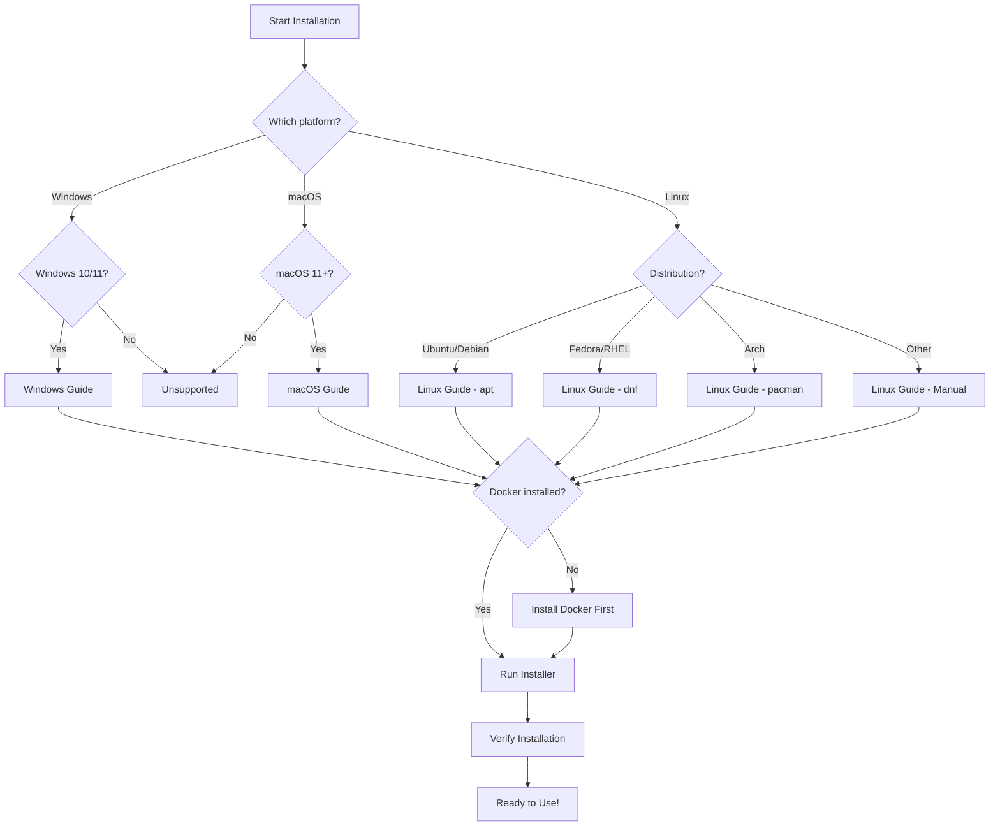

# Installation Documentation

Comprehensive installation guides for ragged across all supported platforms.

## Quick Navigation

**By Platform:**
- [Windows Installation](./windows.md) - Windows 10 and Windows 11
- [macOS Installation](./macos.md) - macOS 11 (Big Sur) and later
- [Linux Installation](./linux.md) - Ubuntu, Fedora, Arch, and other distributions

**By Use Case:**
- [Quick Start](../quick-start.md) - Get running in 5 minutes
- [Enterprise Installation](./enterprise.md) - Silent install, multi-user, LDAP
- [Offline Installation](./offline.md) - Air-gapped environments
- [Docker-Only Mode](./linux.md) - Minimal dependencies

## Installation Decision Tree



## Prerequisites Overview

| Prerequisite | Windows | macOS | Linux | Notes |
|-------------|---------|-------|-------|-------|
| Python 3.12+ | Required | Required | Required | Installer manages this |
| Docker Desktop | Required | Required | Docker Engine | For ChromaDB |
| Ollama | Required | Required | Required | For LLM inference |
| 8GB RAM | Required | Required | Required | 16GB recommended |
| 10GB Disk | Required | Required | Required | More for documents |
| Internet | Required | Required | Required | For initial download |

## One-Command Installation

**macOS/Linux:**
```bash
curl -sSL https://install.ragged.ai | sh
```

**Windows (PowerShell as Administrator):**
```powershell
irm https://install.ragged.ai/windows | iex
```

## Verification

After installation, verify everything is working:

```bash
ragged health
```

Expected output:
```
╭─────────────────────────────────────────────────────╮
│              Ragged Health Status                    │
├─────────────────────────────────────────────────────┤
│  ✅ Python 3.12.0                                   │
│  ✅ Docker Desktop 4.25.0                           │
│  ✅ Ollama 0.1.17                                   │
│  ✅ ChromaDB (healthy)                              │
│  ✅ API Server (localhost:8000)                     │
│  ✅ WebUI (localhost:5173)                          │
╰─────────────────────────────────────────────────────╯
```

## Troubleshooting

If installation fails, see our [Troubleshooting Guide](../troubleshooting/README.md) or:

1. Run diagnostics: `ragged diagnose`
2. View logs: `ragged logs --tail 50`
3. Check [FAQ](../faq.md) for common issues

---

## Related Documentation

- [Quick Start Guide](../quick-start.md) - Get running in 5 minutes
- [Troubleshooting](../troubleshooting/README.md) - Resolve common issues
- [Video Tutorials](../videos/README.md) - Visual installation guides
- [FAQ](../faq.md) - Frequently asked questions

---
